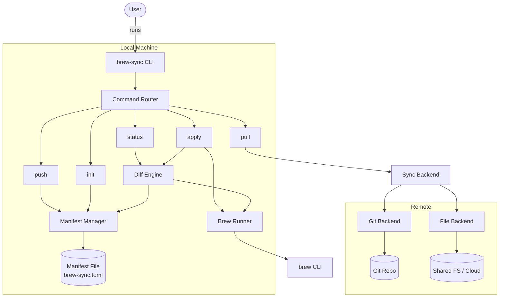
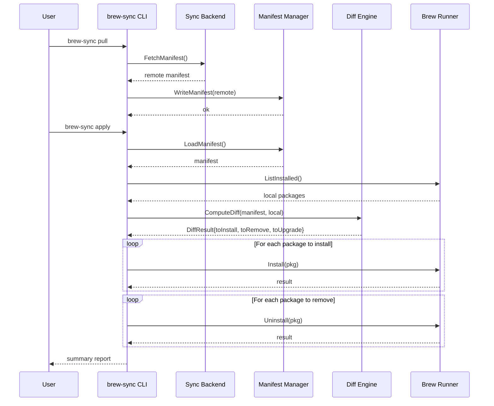
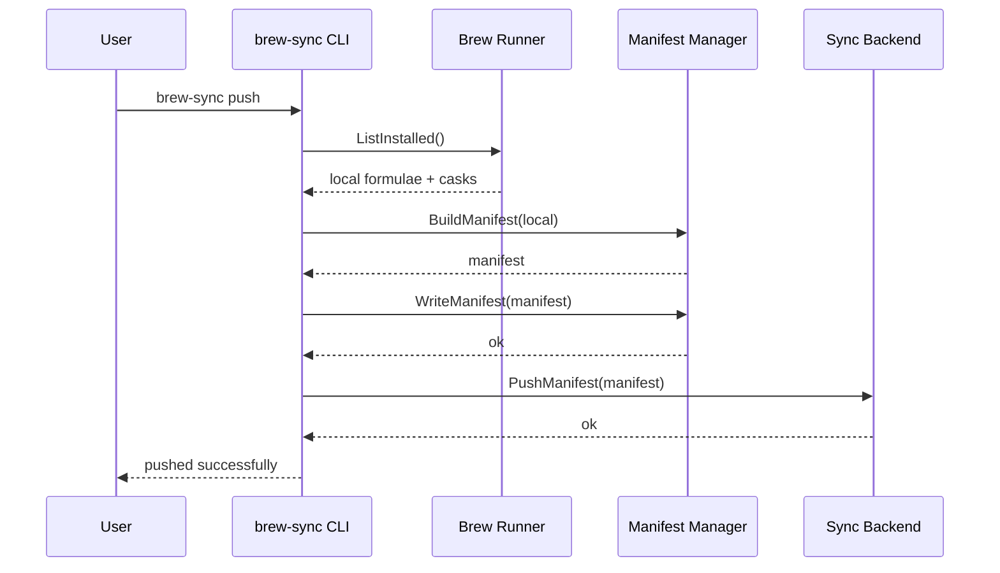

# Design Document: brew-sync

## Overview

brew-sync is a Go CLI tool that wraps Homebrew to synchronize installed packages (formulae and casks) across multiple machines. Users maintain a declarative manifest file (a "Brewfile-like" sync manifest) that describes the desired set of packages. The tool detects drift between the manifest and the local Homebrew installation, then applies changes to converge the local state to the declared state.

The tool is designed around a pull-based model: each machine independently pulls the shared manifest from a configurable sync backend (Git repository, cloud storage, or a simple shared file) and reconciles its local Homebrew state. This avoids the need for direct machine-to-machine communication and works naturally with existing developer workflows.

brew-sync is not a replacement for Homebrew — it delegates all package operations to the `brew` CLI and focuses exclusively on the synchronization layer: manifest management, diff computation, and orchestrated apply.

## Architecture



## Sequence Diagrams

### Sync Workflow (pull + apply)



### Push Workflow (snapshot local → remote)



## Components and Interfaces

### Component 1: CLI (Command Router)

**Purpose**: Parses command-line arguments and dispatches to the appropriate command handler. Built with a standard Go CLI library (cobra).

```go
// cmd/root.go
type RootCmd struct {
    ConfigPath string
    Verbose    bool
    DryRun     bool
}

// Each subcommand is registered on the root command.
// Subcommands: init, status, push, pull, apply
```

**Responsibilities**:
- Parse global flags (--config, --verbose, --dry-run)
- Route to subcommand handlers
- Handle top-level error reporting and exit codes

### Component 2: Manifest Manager

**Purpose**: Reads, writes, and validates the sync manifest file (TOML format).

```go
type ManifestManager interface {
    Load(path string) (*Manifest, error)
    Save(path string, m *Manifest) error
    BuildFromLocal(formulae []Package, casks []Package) *Manifest
    Validate(m *Manifest) error
}
```

**Responsibilities**:
- Serialize/deserialize TOML manifest
- Validate manifest structure and package entries
- Build a manifest from the current local Homebrew state

### Component 3: Brew Runner

**Purpose**: Wraps the `brew` CLI to query and mutate the local Homebrew installation.

```go
type BrewRunner interface {
    ListFormulae() ([]Package, error)
    ListCasks() ([]Package, error)
    Install(pkg Package) error
    Uninstall(pkg Package) error
    Upgrade(pkg Package) error
    Update() error
    IsInstalled() bool
}
```

**Responsibilities**:
- Execute `brew` commands and parse output
- Provide a testable abstraction over the real CLI
- Handle brew command failures gracefully

### Component 4: Diff Engine

**Purpose**: Compares the declared manifest against the locally installed packages and produces a diff result.

```go
type DiffEngine interface {
    ComputeDiff(manifest *Manifest, local *LocalState) *DiffResult
}
```

**Responsibilities**:
- Identify packages to install, remove, and upgrade
- Respect machine-specific tags/filters in the manifest
- Produce a human-readable diff summary

### Component 5: Sync Backend

**Purpose**: Handles pushing and pulling the manifest to/from a remote location.

```go
type SyncBackend interface {
    Pull(dest string) error
    Push(src string) error
    Name() string
}
```

**Responsibilities**:
- Abstract over different sync mechanisms (Git, file copy)
- Handle authentication and connectivity errors
- Provide idempotent push/pull operations

## Data Models

### Manifest (brew-sync.toml)

```go
type Manifest struct {
    Version  int              `toml:"version"`
    Metadata ManifestMetadata `toml:"metadata"`
    Formulae []PackageEntry   `toml:"formulae"`
    Casks    []PackageEntry   `toml:"casks"`
    Taps     []string         `toml:"taps"`
}

type ManifestMetadata struct {
    UpdatedAt string `toml:"updated_at"`
    UpdatedBy string `toml:"updated_by"`
    Machine   string `toml:"machine"`
}

type PackageEntry struct {
    Name     string   `toml:"name"`
    Version  string   `toml:"version,omitempty"`
    OnlyOn   []string `toml:"only_on,omitempty"`   // machine tags
    ExceptOn []string `toml:"except_on,omitempty"` // machine exclusions
}
```

**Validation Rules**:
- `Version` must be 1 (current schema version)
- Each `PackageEntry.Name` must be non-empty and unique within its section
- `OnlyOn` and `ExceptOn` are mutually exclusive per entry
- `Taps` entries must match the `owner/repo` format

**Example manifest file**:

```toml
version = 1

[metadata]
updated_at = "2025-01-15T10:30:00Z"
updated_by = "alice"
machine = "alice-macbook"

taps = ["homebrew/cask-fonts", "hashicorp/tap"]

[[formulae]]
name = "git"

[[formulae]]
name = "go"
version = "1.23"

[[formulae]]
name = "docker"
only_on = ["work-laptop"]

[[casks]]
name = "firefox"

[[casks]]
name = "slack"
except_on = ["home-desktop"]
```

### DiffResult

```go
type DiffResult struct {
    ToInstall []PackageEntry
    ToRemove  []PackageEntry
    ToUpgrade []PackageEntry
    Unchanged []PackageEntry
}
```

### LocalState

```go
type LocalState struct {
    Formulae []Package
    Casks    []Package
    Taps     []string
}

type Package struct {
    Name    string
    Version string
}
```

### Config

```go
type Config struct {
    ManifestPath string `toml:"manifest_path"`
    MachineTag   string `toml:"machine_tag"`
    SyncBackend  string `toml:"sync_backend"` // "git" or "file"
    Git          GitConfig  `toml:"git"`
    File         FileConfig `toml:"file"`
}

type GitConfig struct {
    RepoURL string `toml:"repo_url"`
    Branch  string `toml:"branch"`
}

type FileConfig struct {
    RemotePath string `toml:"remote_path"`
}
```

## Key Functions with Formal Specifications

### Function 1: ComputeDiff

```go
func ComputeDiff(manifest *Manifest, local *LocalState, machineTag string) *DiffResult
```

**Preconditions:**
- `manifest` is non-nil and has been validated
- `local` is non-nil and represents the current Homebrew state
- `machineTag` is a non-empty string identifying the current machine

**Postconditions:**
- Returns a non-nil `DiffResult`
- `ToInstall` contains only packages present in manifest but absent locally
- `ToRemove` contains only packages present locally but absent from manifest
- `ToUpgrade` contains only packages present in both but with a newer version in manifest
- `Unchanged` contains packages present in both with matching versions
- The union of all four sets equals the union of manifest packages and local packages
- Packages filtered out by `only_on`/`except_on` for the current machine are excluded from `ToInstall`

**Loop Invariants:**
- At each iteration over manifest entries, all previously classified packages are in exactly one result set

### Function 2: BuildFromLocal

```go
func BuildFromLocal(formulae []Package, casks []Package, taps []string) *Manifest
```

**Preconditions:**
- `formulae` and `casks` are non-nil (may be empty slices)
- Each `Package` has a non-empty `Name`

**Postconditions:**
- Returns a valid `Manifest` with `Version` set to 1
- `Manifest.Formulae` has one entry per input formula, sorted by name
- `Manifest.Casks` has one entry per input cask, sorted by name
- `Manifest.Taps` matches the input taps, sorted
- `Metadata.UpdatedAt` is set to the current time
- No `OnlyOn` or `ExceptOn` filters are set (local snapshot has no machine filters)

### Function 3: ApplyDiff

```go
func ApplyDiff(diff *DiffResult, runner BrewRunner, dryRun bool) (*ApplyReport, error)
```

**Preconditions:**
- `diff` is non-nil and was produced by `ComputeDiff`
- `runner` is a valid, connected `BrewRunner`
- If `dryRun` is true, no mutations occur

**Postconditions:**
- If `dryRun` is true: returns report with planned actions, no side effects
- If `dryRun` is false: all packages in `ToInstall` are installed, all in `ToRemove` are uninstalled, all in `ToUpgrade` are upgraded
- `ApplyReport` contains success/failure status for each operation
- On partial failure: already-applied changes are not rolled back, report indicates which operations failed
- Returns error only for fatal failures (e.g., brew not found)

### Function 4: FilterForMachine

```go
func FilterForMachine(entries []PackageEntry, machineTag string) []PackageEntry
```

**Preconditions:**
- `entries` is non-nil
- `machineTag` is a non-empty string

**Postconditions:**
- Returns a subset of `entries` where:
  - If `OnlyOn` is set: entry is included only if `machineTag` is in `OnlyOn`
  - If `ExceptOn` is set: entry is included only if `machineTag` is NOT in `ExceptOn`
  - If neither is set: entry is always included
- Original `entries` slice is not modified

**Loop Invariants:**
- For each processed entry, the inclusion decision is based solely on that entry's `OnlyOn`/`ExceptOn` and the `machineTag`

## Algorithmic Pseudocode

### Diff Computation Algorithm

```go
// ComputeDiff determines what actions are needed to converge local state to manifest.
//
// ALGORITHM:
//   1. Filter manifest entries for the current machine
//   2. Build lookup maps for O(1) membership checks
//   3. Walk manifest entries: classify as install, upgrade, or unchanged
//   4. Walk local entries: classify remaining as remove or unchanged
//
// Time complexity: O(m + l) where m = manifest entries, l = local entries
// Space complexity: O(m + l) for the lookup maps

func ComputeDiff(manifest *Manifest, local *LocalState, machineTag string) *DiffResult {
    result := &DiffResult{}

    // Step 1: Filter manifest packages for this machine
    formulae := FilterForMachine(manifest.Formulae, machineTag)
    casks := FilterForMachine(manifest.Casks, machineTag)

    // Step 2: Build local lookup maps  name -> version
    localFormulaeMap := make(map[string]string)
    for _, pkg := range local.Formulae {
        localFormulaeMap[pkg.Name] = pkg.Version
    }
    localCasksMap := make(map[string]string)
    for _, pkg := range local.Casks {
        localCasksMap[pkg.Name] = pkg.Version
    }

    // Step 3: Walk manifest entries
    // Invariant: each manifest entry is classified into exactly one of
    //            {ToInstall, ToUpgrade, Unchanged}
    seen := make(map[string]bool)

    for _, entry := range formulae {
        seen[entry.Name] = true
        localVersion, exists := localFormulaeMap[entry.Name]
        if !exists {
            result.ToInstall = append(result.ToInstall, entry)
        } else if entry.Version != "" && entry.Version != localVersion {
            result.ToUpgrade = append(result.ToUpgrade, entry)
        } else {
            result.Unchanged = append(result.Unchanged, entry)
        }
    }

    for _, entry := range casks {
        seen[entry.Name] = true
        localVersion, exists := localCasksMap[entry.Name]
        if !exists {
            result.ToInstall = append(result.ToInstall, entry)
        } else if entry.Version != "" && entry.Version != localVersion {
            result.ToUpgrade = append(result.ToUpgrade, entry)
        } else {
            result.Unchanged = append(result.Unchanged, entry)
        }
    }

    // Step 4: Walk local entries — anything not in manifest is a removal candidate
    // Invariant: each local entry not in `seen` is classified as ToRemove
    for _, pkg := range local.Formulae {
        if !seen[pkg.Name] {
            result.ToRemove = append(result.ToRemove, PackageEntry{Name: pkg.Name})
        }
    }
    for _, pkg := range local.Casks {
        if !seen[pkg.Name] {
            result.ToRemove = append(result.ToRemove, PackageEntry{Name: pkg.Name})
        }
    }

    return result
}
```

### Apply Algorithm

```go
// ApplyDiff executes the diff against the local Homebrew installation.
//
// ALGORITHM:
//   1. If dry-run, log planned actions and return
//   2. Install missing packages (order: taps first, then formulae, then casks)
//   3. Upgrade outdated packages
//   4. Remove extra packages (only if user confirmed)
//   5. Collect results into report
//
// Partial failure strategy: continue on individual package failure,
// record error in report, return aggregate error at end.

func ApplyDiff(diff *DiffResult, runner BrewRunner, dryRun bool) (*ApplyReport, error) {
    report := &ApplyReport{}

    if dryRun {
        report.Planned = true
        report.InstallCount = len(diff.ToInstall)
        report.RemoveCount = len(diff.ToRemove)
        report.UpgradeCount = len(diff.ToUpgrade)
        return report, nil
    }

    // Install missing packages
    for _, pkg := range diff.ToInstall {
        err := runner.Install(Package{Name: pkg.Name, Version: pkg.Version})
        report.RecordResult("install", pkg.Name, err)
    }

    // Upgrade outdated packages
    for _, pkg := range diff.ToUpgrade {
        err := runner.Upgrade(Package{Name: pkg.Name, Version: pkg.Version})
        report.RecordResult("upgrade", pkg.Name, err)
    }

    // Remove extra packages
    for _, pkg := range diff.ToRemove {
        err := runner.Uninstall(Package{Name: pkg.Name})
        report.RecordResult("remove", pkg.Name, err)
    }

    if report.HasErrors() {
        return report, fmt.Errorf("apply completed with %d errors", report.ErrorCount)
    }
    return report, nil
}
```

### Manifest Validation Algorithm

```go
// Validate checks a manifest for structural correctness.
//
// ALGORITHM:
//   1. Check version is supported
//   2. Check for duplicate package names within each section
//   3. Check that only_on and except_on are mutually exclusive
//   4. Check tap format (owner/repo)
//
// Returns a multi-error collecting all validation failures.

func Validate(m *Manifest) error {
    var errs []error

    // Step 1: Version check
    if m.Version != 1 {
        errs = append(errs, fmt.Errorf("unsupported manifest version: %d", m.Version))
    }

    // Step 2: Duplicate check within formulae
    seen := make(map[string]bool)
    for _, entry := range m.Formulae {
        if entry.Name == "" {
            errs = append(errs, fmt.Errorf("formula entry has empty name"))
            continue
        }
        if seen[entry.Name] {
            errs = append(errs, fmt.Errorf("duplicate formula: %s", entry.Name))
        }
        seen[entry.Name] = true
    }

    // Duplicate check within casks
    seen = make(map[string]bool)
    for _, entry := range m.Casks {
        if entry.Name == "" {
            errs = append(errs, fmt.Errorf("cask entry has empty name"))
            continue
        }
        if seen[entry.Name] {
            errs = append(errs, fmt.Errorf("duplicate cask: %s", entry.Name))
        }
        seen[entry.Name] = true
    }

    // Step 3: Mutual exclusivity of only_on / except_on
    for _, entry := range append(m.Formulae, m.Casks...) {
        if len(entry.OnlyOn) > 0 && len(entry.ExceptOn) > 0 {
            errs = append(errs, fmt.Errorf(
                "package %s has both only_on and except_on set", entry.Name))
        }
    }

    // Step 4: Tap format validation
    for _, tap := range m.Taps {
        if !isValidTapFormat(tap) {
            errs = append(errs, fmt.Errorf("invalid tap format: %s (expected owner/repo)", tap))
        }
    }

    return errors.Join(errs...)
}
```

## Example Usage

```go
// Example 1: Initialize a new manifest from current machine
//   $ brew-sync init
func initCmd() {
    runner := NewBrewRunner()
    formulae, _ := runner.ListFormulae()
    casks, _ := runner.ListCasks()
    
    manifest := BuildFromLocal(formulae, casks, taps)
    manager := NewManifestManager()
    manager.Save("brew-sync.toml", manifest)
}

// Example 2: Check status (what would change)
//   $ brew-sync status
func statusCmd() {
    manifest, _ := manager.Load("brew-sync.toml")
    local := &LocalState{
        Formulae: runner.ListFormulae(),
        Casks:    runner.ListCasks(),
    }
    diff := ComputeDiff(manifest, local, config.MachineTag)
    printDiffSummary(diff)
}

// Example 3: Full sync from remote
//   $ brew-sync pull && brew-sync apply
func syncWorkflow() {
    backend.Pull("brew-sync.toml")
    manifest, _ := manager.Load("brew-sync.toml")
    local := getLocalState(runner)
    diff := ComputeDiff(manifest, local, config.MachineTag)
    report, _ := ApplyDiff(diff, runner, false)
    printReport(report)
}

// Example 4: Dry run before applying
//   $ brew-sync apply --dry-run
func dryRunExample() {
    diff := ComputeDiff(manifest, local, config.MachineTag)
    report, _ := ApplyDiff(diff, runner, true)
    // Output: Would install 3, remove 1, upgrade 2 packages
    fmt.Printf("Would install %d, remove %d, upgrade %d packages\n",
        report.InstallCount, report.RemoveCount, report.UpgradeCount)
}
```

## Correctness Properties

The following properties must hold for any valid inputs:

1. **Diff completeness**: For any manifest M and local state L, every package in M ∪ L appears in exactly one of {ToInstall, ToRemove, ToUpgrade, Unchanged}.

2. **Diff soundness**: A package appears in ToInstall only if it is in the manifest and not installed locally. A package appears in ToRemove only if it is installed locally and not in the manifest.

3. **Machine filter correctness**: For any package with `only_on = [X]`, if `machineTag ≠ X`, the package does not appear in ToInstall. For any package with `except_on = [X]`, if `machineTag = X`, the package does not appear in ToInstall.

4. **Idempotency**: Applying a diff and then recomputing the diff yields an empty diff (no installs, no removes, no upgrades).

5. **Manifest round-trip**: `Load(Save(m)) == m` for any valid manifest m. Serialization and deserialization preserve all fields.

6. **Validation completeness**: A manifest with duplicate names, empty names, both `only_on` and `except_on` set, or invalid tap format is rejected by `Validate`.

7. **Dry-run safety**: When `dryRun = true`, `ApplyDiff` produces a report but makes zero calls to `runner.Install`, `runner.Uninstall`, or `runner.Upgrade`.

8. **Filter mutual exclusivity**: `FilterForMachine` never includes a package where `machineTag` is in `ExceptOn`, and never excludes a package where `machineTag` is in `OnlyOn` (unless `ExceptOn` also applies, which is invalid per validation).

## Error Handling

### Error Scenario 1: Brew Not Installed

**Condition**: `brew` binary is not found in PATH
**Response**: Return a clear error message: "brew not found. Please install Homebrew first: https://brew.sh"
**Recovery**: Exit with non-zero status. No partial operations attempted.

### Error Scenario 2: Manifest Not Found

**Condition**: `brew-sync.toml` does not exist when running status/apply
**Response**: Return error suggesting `brew-sync init` or `brew-sync pull`
**Recovery**: User runs init or pull to create the manifest.

### Error Scenario 3: Partial Apply Failure

**Condition**: Some packages fail to install/remove during apply
**Response**: Continue processing remaining packages. Collect all errors into the `ApplyReport`.
**Recovery**: User reviews the report and can re-run `brew-sync apply` (idempotent). Failed packages will be retried.

### Error Scenario 4: Sync Backend Unreachable

**Condition**: Git remote or file path is not accessible during push/pull
**Response**: Return error with backend-specific details (e.g., git clone failure, file not found)
**Recovery**: User fixes connectivity or configuration and retries.

### Error Scenario 5: Invalid Manifest

**Condition**: Manifest file has syntax errors or fails validation
**Response**: Return all validation errors (multi-error) so user can fix them in one pass
**Recovery**: User edits the manifest to fix reported issues.

## Testing Strategy

### Unit Testing Approach

- **Diff Engine**: Test with various combinations of manifest and local state. Cover empty sets, identical sets, disjoint sets, partial overlaps, and machine-filtered entries.
- **Manifest Manager**: Test Load/Save round-trips, validation of invalid manifests, BuildFromLocal with edge cases.
- **FilterForMachine**: Test all combinations of only_on, except_on, and neither.
- **Validation**: Test each validation rule independently and in combination.

Use Go's standard `testing` package with table-driven tests.

### Property-Based Testing Approach

**Property Test Library**: `pgregory.net/rapid` (Go property-based testing library)

Key properties to test with random generation:
- Diff completeness: randomly generated manifests and local states always produce a complete partition
- Manifest round-trip: randomly generated valid manifests survive Load/Save
- Filter correctness: randomly generated entries with machine tags produce correct inclusion/exclusion

### Integration Testing Approach

- Use a mock `BrewRunner` that simulates brew behavior without requiring actual Homebrew
- Test full command workflows: init → push → (on another mock machine) pull → apply
- Test the Git sync backend with a local bare repository

## Performance Considerations

- Package lists are typically small (tens to low hundreds of entries), so algorithmic complexity is not a concern. Linear scans are acceptable.
- The `brew` CLI is the bottleneck — each install/uninstall is a separate process invocation. Consider parallelizing independent installs if brew supports it (it does not currently lock well, so sequential is safer).
- Manifest parsing and diff computation are negligible compared to brew operations.

## Security Considerations

- brew-sync does not handle credentials directly. Git authentication is delegated to the user's existing git/ssh configuration.
- The manifest file may be stored in a public or shared repository. It contains only package names and versions — no secrets.
- The tool executes `brew install` and `brew uninstall` commands. A malicious manifest could install unwanted software. Users should review diffs before applying (`brew-sync status` or `--dry-run`).
- Shell command injection is prevented by passing package names as arguments to `exec.Command` (not through a shell).

## Dependencies

| Dependency | Purpose |
|---|---|
| `github.com/spf13/cobra` | CLI framework for command routing and flag parsing |
| `github.com/BurntSushi/toml` | TOML parsing and serialization for manifest files |
| `pgregory.net/rapid` | Property-based testing library (test dependency) |
| `os/exec` (stdlib) | Executing brew CLI commands |
| `os/exec` + `git` | Git operations for the sync backend |
